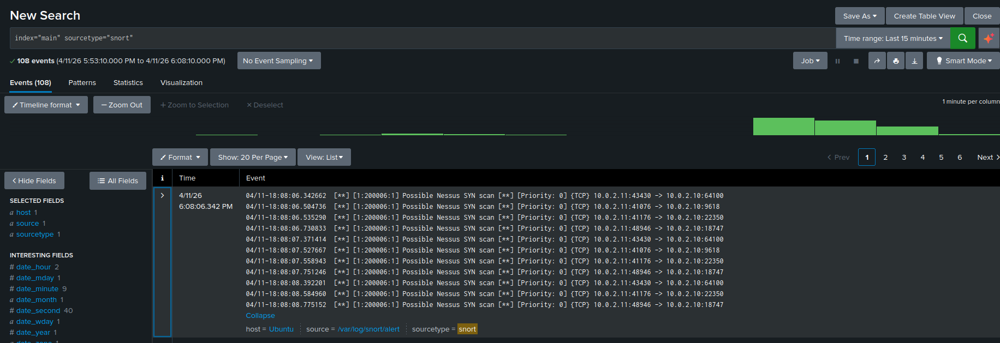
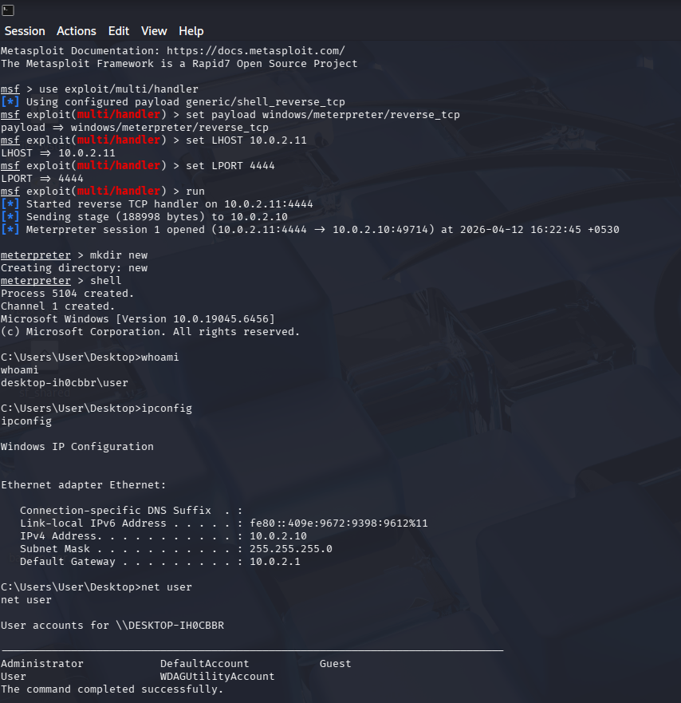
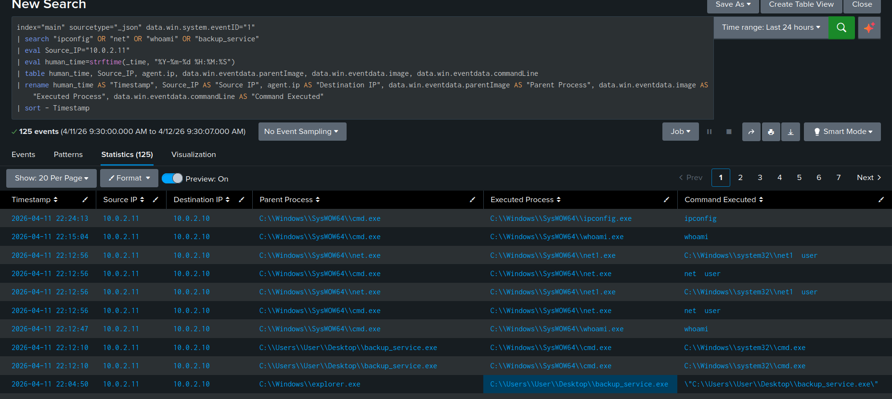

# Comprehensive SOC Simulation: Splunk + Wazuh + Snort

## Demo Video
Watch the full project demo: [Click here](your-onedrive-link-here)

## Overview
Simulated a full-chain cyberattack against a Windows VM and detected
every stage using a 3-layer SOC stack. Attack chain covered:
recon → credential brute force → payload drop → reverse shell C2.
All stages detected in real time across network and endpoint layers.

## Environment
- Windows VM (10.0.2.10) — victim with SMB, Wazuh Agent, Sysmon
- Kali VM (10.0.2.11) — attacker with Nessus, Metasploit, msfvenom
- Ubuntu VM (10.0.2.15) — SOC with Splunk, Wazuh Manager, Snort

## Full Attack Chain + Detection

| Stage | Attack | Detection Tool | Result |
|---|---|---|---|
| Recon | Nessus + Nmap SYN scan | Snort NIDS | 108 alerts in Splunk |
| Credential Access | SMB brute force (rockyou.txt) | Wazuh + Splunk Event ID 4625 | 0 successful logins |
| Payload Drop | EICAR file on Desktop | Wazuh FIM (Syscheck) | Flagged in seconds |
| Execution + C2 | Meterpreter reverse shell port 4444 | Custom Snort rule | C2 traffic caught |
| Post-Exploitation | whoami, ipconfig, net user | Sysmon Event ID 1 in Splunk | Full process tree logged |

## Key Results
- 108 SYN scan events aggregated and attributed to Kali IP in Splunk
- SMB brute force blocked by Account Lockout Policy
- EICAR payload detected immediately by Wazuh File Integrity Monitor
- Custom Snort rule caught Meterpreter C2 on port 4444
- Sysmon process tree in Splunk showed backup_service.exe → cmd.exe

## Tools Used
Splunk Enterprise, Wazuh Manager (EDR), Snort IDS,
Cisco Talos threat intel feeds, Sysmon, Metasploit Framework,
msfvenom, Nessus Essentials, Kali Linux, Windows 10, VirtualBox

## Files in This Repo
- [Project Report](soc.pdf)
- [Custom Snort Rules](snort-rules/local.rules)

## Screenshots
.png)

